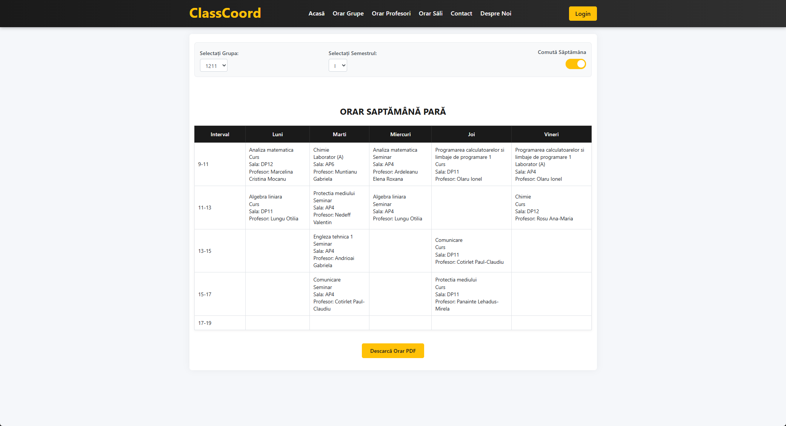

# ClassCoord - Aplicație Web pentru crearea orarelor pentru universitate
**Demo:** https://orar.rgsoft.ro/
## Despre proiect

ClassCoord este o aplicație web dezvoltată pentru a simplifica și automatiza procesul de creare a orarelor în mediul universitar. Acest proiect a apărut din nevoia de a eficientiza una dintre cele mai complexe sarcini administrative cu care se confruntă universitățile - planificarea și gestionarea orarelor.

În mediul academic, realizarea manuală a orarelor implică multe provocări: evitarea suprapunerilor, respectarea disponibilității profesorilor, alocarea corectă a sălilor în funcție de capacitate și tipul activității didactice, și gestionarea cât mai eficientă a orelor de curs, laborator, seminar și proiect pentru diferite grupe și specializări.



## Tehnologii utilizate

### Backend
- **Python**
- **Flask**
- **MySQL**
- **Flask-MySQLdb**
- **SMTP si hashlib**

### Frontend
- **HTML5 si CSS3**
- **JavaScript**
- **jQuery**
- **AJAX**
- **jsPDF**

## Cum funcționează

ClassCoord funcționează pe baza unui algoritm de alocare și optimizare care ia în considerare mai mulți factori:

1. **Colectarea datelor** - Sistemul stochează informații despre:
   - Departamente și specializări
   - Profesori și disponibilitatea lor
   - Grupe de studenți și anii de studiu
   - Săli disponibile (capacitate, echipamente, tip)
   - Materii și tipurile de activități asociate (curs, laborator, seminar, proiect)

2. **Algoritmul de generare a orarului**:
   - Analizează cerințele fiecărei materii (număr de ore, tip activitate)
   - Verifică disponibilitatea profesorilor
   - Identifică sălile potrivite în funcție de capacitate și tipul activității
   - Repartizează orele evitând suprapunerile
   - Optimizează utilizarea resurselor (săli, timp)
   - Gestionează separat activitățile pentru semigrupe

3. **Gestionarea orarelor**:
   - Orarele generate sunt salvate în format JSON
   - Interfața permite vizualizarea orarelor filtrate după criteriile dorite (grupă, profesor, sală)
   - Funcția de export PDF facilitează distribuirea și imprimarea orarelor

4. **Interfața administrativă**:
   - Formular de autentificare securizat
   - Panouri de administrare pentru gestionarea entităților
   - Posibilitatea de a adăuga, modifica sau șterge informații
   - Regenerarea orarelor când este necesar

### Pași de instalare

1. **Clonează repository-ul**
   ```bash
   git clone https://github.com/your-username/classcoord.git
   cd classcoord
   ```

2. **Instalează dependențele Python**
   ```bash
   pip install -r requirements.txt
   ```

3. **Configurează baza de date MySQL**
   - Creează o bază de date numită `DB_CREDENTIAL`
   - Creează un utilizator `DB_CREDENTIAL` cu parola `DB_CREDENTIAL` și acordă-i drepturi de acces asupra bazei de date
   - Importă structura bazei de date din fișierul `DB_CREDENTIAL.sql`
   ```sql
   CREATE DATABASE DB_CREDENTIAL;
   CREATE USER 'DB_CREDENTIAL'@'localhost' IDENTIFIED BY 'DB_CREDENTIAL';
   GRANT ALL PRIVILEGES ON DB_CREDENTIAL.* TO 'DB_CREDENTIAL'@'localhost';
   FLUSH PRIVILEGES;
   
   -- Apoi importa structura
   mysql -u DB_CREDENTIAL -p DB_CREDENTIAL < DB_CREDENTIAL.sql
   ```

4. **Rulează aplicația**
   ```bash
   python main.py
   ```

