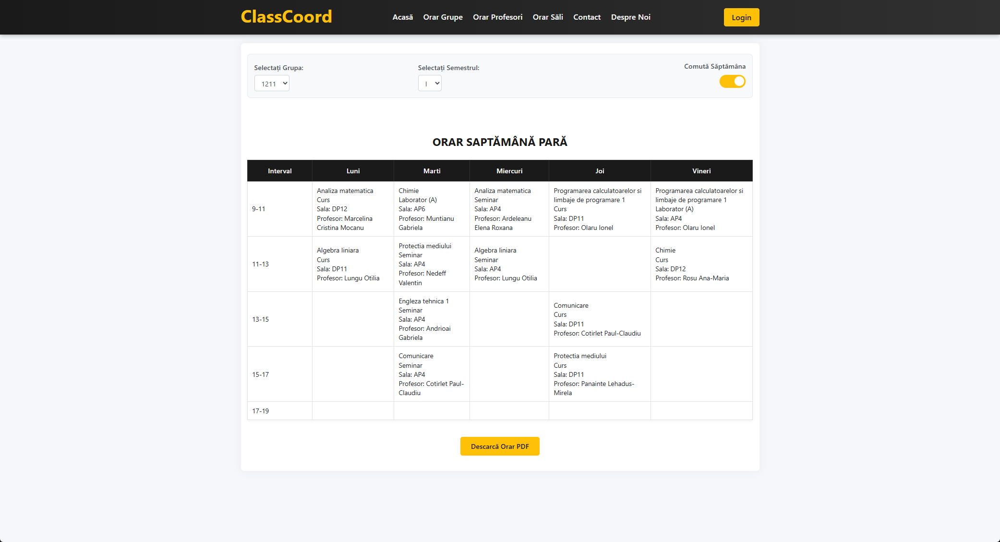

# ClassCoord — Aplicatie Web pentru Generarea Orarelor Universitare

**Demo:** https://orar.rgsoft.ro/
**Versiune noua (in dezvoltare):** https://eduorar.ro/

## Despre proiect

ClassCoord este o aplicatie web care automatizeaza crearea orarelor in mediul universitar. Sistemul gestioneaza profesori, sali, grupe, specializari si materii, apoi genereaza orare fara suprapuneri, respectand disponibilitatea profesorilor si capacitatea salilor.



## Functionalitati

- Generare automata a orarului pe baza disponibilitatii profesorilor, capacitatii salilor si tipului activitatii (curs, laborator, seminar, proiect)
- Gestionare separata a semigrupelor
- Filtrare orare dupa grupa, profesor sau sala
- Export orar in format PDF
- Panou de administrare cu autentificare securizata
- Adaugare, modificare si stergere a tuturor entitatilor

## Tehnologii

- **Backend:** Python, Flask, MySQL, Flask-MySQLdb
- **Frontend:** HTML/CSS, JavaScript, jQuery, AJAX

## Instalare

1. **Cloneaza repository-ul**
   ```bash
   git clone https://github.com/robertgrasu/orar-generator.git
   cd orar-generator
   ```

2. **Instaleaza dependentele**
   ```bash
   pip install -r requirements.txt
   ```

3. **Configureaza credentialele bazei de date in `baza_de_date.py`**

4. **Porneste aplicatia**
   ```bash
   python main.py
   ```
